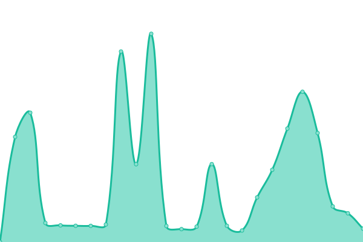

# [📈 Live Status](https://demo.upptime.js.org): <!--live status--> **🟧 Partial outage**

This repository contains the open-source uptime monitor and status page for [devbungfro](https://demo.upptime.js.org), powered by [Upptime](https://github.com/upptime/upptime).

With [Upptime](https://upptime.js.org), you can get your own unlimited and free uptime monitor and status page, powered entirely by a GitHub repository. We use [Issues](https://github.com/devbungfro/dismicstatus/issues) as incident reports, [Actions](https://github.com/devbungfro/dismicstatus/actions) as uptime monitors, and [Pages](https://demo.upptime.js.org) for the status page.

<!--start: status pages-->
<!-- This summary is generated by Upptime (https://github.com/upptime/upptime) -->
<!-- Do not edit this manually, your changes will be overwritten -->
<!-- prettier-ignore -->
| URL | Status | History | Response Time | Uptime |
| --- | ------ | ------- | ------------- | ------ |
|  [Dismic DASHBOARD](https://www.dismic.org) | 🟥 Down | [dismic-dashboard.yml](https://github.com/DevBungfro/dismicstatus/commits/HEAD/history/dismic-dashboard.yml) | 

 1841ms
     
 | 

<a href="https://devbungfro.github.io/dismicstatus//history/dismic-dashboard">98.76%</a>
    

|  [Dismic API](https://apiremake.dismic.org) | 🟩 Up | [dismic-api.yml](https://github.com/DevBungfro/dismicstatus/commits/HEAD/history/dismic-api.yml) | 

 1973ms
     
 | 

<a href="https://devbungfro.github.io/dismicstatus//history/dismic-api">99.42%</a>
    

|  [Dismic CDN](https://cdn.dismic.org) | 🟥 Down | [dismic-cdn.yml](https://github.com/DevBungfro/dismicstatus/commits/HEAD/history/dismic-cdn.yml) | 

 0ms
     
 | 

<a href="https://devbungfro.github.io/dismicstatus//history/dismic-cdn">100.00%</a>
    

|  [Dismic DOCS](https://docs.dismic.org) | 🟩 Up | [dismic-docs.yml](https://github.com/DevBungfro/dismicstatus/commits/HEAD/history/dismic-docs.yml) | 

 200ms
     
 | 

<a href="https://devbungfro.github.io/dismicstatus//history/dismic-docs">100.00%</a>
    

|  [Dismic BOT](https://www.dismic.org/botping) | 🟥 Down | [dismic-bot.yml](https://github.com/DevBungfro/dismicstatus/commits/HEAD/history/dismic-bot.yml) | 

 545ms
     
 | 

<a href="https://devbungfro.github.io/dismicstatus//history/dismic-bot">99.44%</a>
    

|  [Dismic STATUS PAGE](https://status.dismic.org) | 🟥 Down | [dismic-status-page.yml](https://github.com/DevBungfro/dismicstatus/commits/HEAD/history/dismic-status-page.yml) | 

 5073ms
     
 | 

<a href="https://devbungfro.github.io/dismicstatus//history/dismic-status-page">99.14%</a>
    

<!--end: status pages-->

[**Visit our status website →**](https://demo.upptime.js.org)

## 📄 License

- Powered by: [Upptime](https://github.com/upptime/upptime)
- Code: [MIT](./LICENSE) © [devbungfro](https://demo.upptime.js.org)
- Data in the `./history` directory: [Open Database License](https://opendatacommons.org/licenses/odbl/1-0/)
